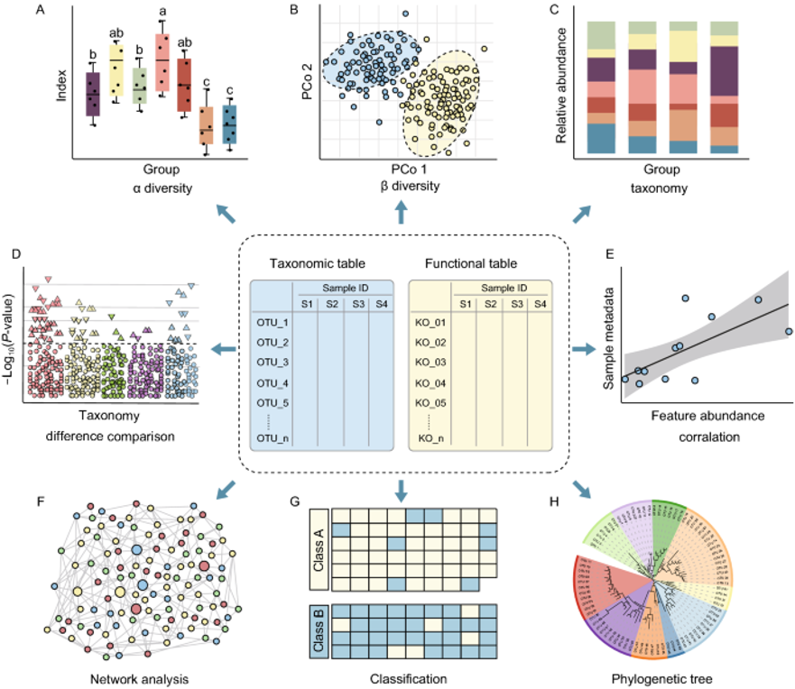
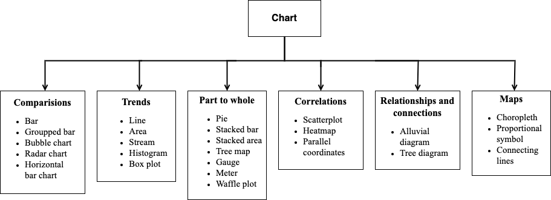
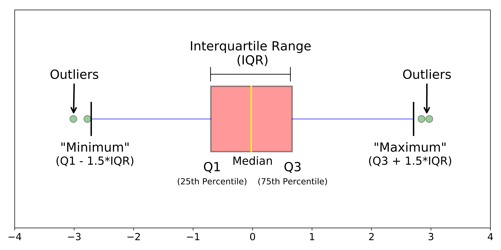

```{r setup, include=FALSE}
knitr::opts_chunk$set(echo = TRUE, warning = FALSE,
                      fig.pos = 'H', fig.align = 'center',
                      fig.width = 6, fig.height = 4, out.width = '80%')
```

# Introduction to Data Visualization

## Data Visualization

* Represent data in the form of graphs, charts, plots, ...
* A story conveyed through visuals
* Patterns, trends, anomalies in data

```{r, echo=FALSE, fig.cap="Data Visualization", fig.pos='H'}

```

## Chart types

There are six main categories of chart:

* **Comparisons**: visualizations for comparing categories, such as bar charts, grouped bars, bubble charts, radar charts, and horizontal bar charts.
* **Trends**: charts that show changes over time or sequence, including line charts, area charts, stream graphs, histograms, and box plots.
* **Part to Whole**: charts that illustrate how individual components contribute to a whole, such as pie charts, stacked bars, stacked areas, tree maps, gauges, meters, and waffle plots.
* **Correlations**: visualizations for exploring relationships between variables, including scatterplots, heatmaps, and parallel coordinates.
* **Relationships and Connections**: charts that highlight links or flows, such as alluvial diagrams and tree diagrams.
* **Maps**: spatial data visualizations, including choropleth maps, proportional symbol maps, and connecting lines.


```{r, echo=FALSE, fig.cap="Chart types", fig.pos='H'}

```

## Popular Data Visualization tools

* Microsoft Excel
* Tableu
* Microsoft Power BI
* Google Looker Studio
* Python (Matplotlib, Seaborn)
* R (ggplot2 & Tidyverse)

## R (ggplot2) vs. Python (Matplotlib/Seaborn)

* **R**: The Specialist for Analysis & Graphics
* **Python**: The General-Purpose Swiss Army Knife

**Choose R if:**

* Your daily work is primarily **analyzing experimental data** (RNA-seq, proteomics, metabolomics, etc.).
* You need to create many **complex, high-quality graphics for reports and scientific publications**.
* You want to leverage the massive **Bioconductor** ecosystem and cutting-edge statistical methods.
* You appreciate the logical and structured approach of the **"Grammar of Graphics."**

**Choose Python if:**

* Visualization is just **one step in a larger pipeline** involving image processing, machine learning, automation, or software development.
* You need to **integrate your analyses into a website or application**.
* You are already familiar with Python and want to **keep everything in one environment**.
* You work heavily with deep learning models for biological problems (e.g., AlphaFold).

**Advice:** A great bioinformatician often knows both. They might use **R for exploration, statistical analysis, and quick plotting**, then switch to **Python to build automated pipelines or complex models**.

# What is ggplot?

* A package in the tidyverse ecosystem of R
* Developed by Hadley Wickham
* Based on the Grammar of Graphics
* Create high-quality and customizable plots (publication ready)
* Unified syntax for different types of Visualization

## Grammar of Graphics

```{r, eval=FALSE}
# Do NOT excute
A plot = Data +    # the dataset used
	   Aesthetics +  # mapping variables to visual properties (x, y, color, size, shape)
	   Geoms +       # geometric objects (points, lines, bars, boxplots, ...)
	   Stats +       # statistical transformations (binning, smoothing, summaries)
	   Scales +      # how values are translated into position, color, size, ...
	   Coordinates + # the coordinate system (Cartesian, polar, log, ...)
	   Facets +      # splitting data into multiple small plots
	   Theme +       # non-data elements (background, fonts, grid, legend position, ...)
		...

```


# Getting familiar with a dataset

## Loading packages

This code chunk shows the loading of the packages required for the analyses. Here, we are using the `p_load()` function from the **pacman** package, which will install a package if necessary **and** load it for use. You can also load installed packages with the `library()` function from **base** R.

```{r}
pacman::p_load(
  tidyverse,      # includes ggplot2 and other data management tools
  janitor,        # cleaning and summary tables
  ggforce,        # ggplot extras
  rio,            # import/export
  here,           # file locator
  stringr,        # working with characters   
  patchwork       # ghép nhiều biểu đồ
)
```

## Loading the dataset

There are many ways of importing your dataset. In this tutorial, we upload an Excel file then load it into R with the variable name `mydata`.

```{r}
# 1: uploading your excel file manually

# 2: using base R function
#download.file("https://github.com/juhuvn/vsob4/blob/0f2675021f67806ce0fb3c93a792d5648d901abf/Day4/mydata.xlsx", "mydata_case2.xlsx", method = "auto")

# 3: using `rio::import` function to import data directly from an URL
mydata <- rio::import("https://github.com/juhuvn/vsob4/raw/refs/heads/main/Day4/mydata.xlsx", trust=TRUE)

# 4: loading the dataset from current directory
#mydata <- rio::import("mydata.xlsx", trust=TRUE)
```

Getting to know the dataset. In this tutorial, we are mainly working with `age` and `wt_kg` (weight in Kilogram).

```{r}
glimpse(mydata)
```

## Cleaning the dataset

```{r}
# make display version of columns with more friendly names
mydata <- mydata %>%
  mutate(
    gender_disp = case_when(gender == "m" ~ "Male",        # m to Male 
                            gender == "f" ~ "Female",      # f to Female,
                            is.na(gender) ~ "Unknown"      # NA to Unknown
                            )    
  )

mydata <- mydata %>% mutate(
  outcome_disp = replace_na(outcome, "Unknown")          # replace NA outcome with "unknown"
)
```

Reviewing the dataset after mutating, look at the number of the columns and the last two columns.

```{r}
glimpse(mydata)
```

# Structure of Grammar of Graph

## Scatter plot

A scatter plot is a type of graph used to show the relationship between two numerical variables.

* Each point (or “dot”) on the plot represents one observation in your dataset.
* The x-axis shows the values of one variable, and the y-axis shows the values of the other variable.
* By looking at how the points are distributed, you can see whether there is a pattern, such as a positive relationship (as one variable increases, the other tends to increase), a negative relationship (as one increases, the other decreases), or no clear relationship.

Scatter plots are especially useful for:

* Detecting correlations between variables.
* Identifying clusters of data.
* Spotting outliers (points that are far away from the others).

## Basic Structure

The basic structure of the ggplot: Data + Aesthetics + Geom.

```{r, eval=FALSE}

# do NOT excute
ggplot(data = my_data) + 	        # the dataset is my_data
  aes(x = column1, y = column2) + # mapping column1 to x axis, column2 to y axis
	geom_point()			              # point geometric
```

An example of scatter plot with basic structure

```{r}
ggplot(data = mydata) + 	        # the dataset is my_data
	aes(x = age, y = wt_kg) +       # mapping age to x axis, wt_kg to y axis
	geom_point()			              # point geometric
```

## Aesthetic setting

In ggplot2, an aesthetic setting means you assign a fixed value to a graphical property (like color, shape, size, alpha, linetype) outside of `aes()`.

* It does not depend on the data.
* The value is constant for all points/lines/bars.
* No legend is created, because nothing is mapped to a variable.

Set color to all dot.

```{r}
ggplot(data = mydata) + 	        # the dataset is my_data
	aes(x = age, y = wt_kg) +       # mapping age to x axis, wt_kg to y axis
	geom_point(color = "red")			              # point geometric
```

Set color, shape, size and transparency to all dot.

```{r}
ggplot(data = mydata) + 	        # the dataset is my_data
	aes(x = age, y = wt_kg) +       # mapping age to x axis, wt_kg to y axis
	geom_point(color = "red",       # point geometric
	           shape = "triangle", 
	           size = 2,
	           alpha = 0.5)
```


## Aesthetic mapping

In ggplot2, an aesthetic mapping means you connect a data variable to a graphical property (called an aesthetic, e.g., color, size, shape, alpha).

* Write it inside aes().
* The appearance of the plot changes depending on the data values.
* A legend is automatically created, because ggplot2 knows you mapped a variable.

Example:

```{r}
ggplot(data = mydata) + 	        
	aes(x = age, y = wt_kg, 
	    color = gender_disp,
	    shape = outcome_disp) +       
	geom_point(alpha = 0.5)
```


# Faceting the plots

Faceting a plot in `ggplot2` means splitting one plot into multiple small plots (subplots), each showing a subset of the data based on the values of one or more categorical variables.

* Use `facet_wrap()` → lays out subplots in a grid, based on a single variable.
* Use `facet_grid()` → creates a matrix of subplots using two variables (rows × columns).

Faceting is useful to compare patterns across groups while keeping the same scales and style.

An example of `facet_wrap()`

```{r}
ggplot(data = mydata) + 	        
	aes(x = age, y = wt_kg, 
	    color = gender_disp,
	    shape = outcome_disp) +       
	geom_point(alpha = 0.5) + 
  facet_wrap(~gender_disp)
```

An example of `facet_grid()`

```{r}
ggplot(data = mydata) + 	        
	aes(x = age, y = wt_kg, 
	    color = gender_disp,
	    shape = outcome_disp) +       
	geom_point(alpha = 0.5) + 
  facet_grid(gender_disp ~ outcome_disp)
```

# Labeling the plot

Labeling the plot means adding descriptive text elements that help readers understand what the plot shows. This usually includes:

* Title → the main heading of the plot.
* Subtitle → additional explanation or context.
* Axis labels → describe what each axis represents.
* Caption → source of data or extra notes.
* Legends → labels for colors, shapes, or other aesthetics mapped to data.
* Annotations → text directly added inside the plot for emphasis.

```{r}
ggplot(data = mydata) + 	        
	aes(x = age, y = wt_kg, 
	    color = gender_disp,
	    shape = outcome_disp) +       
	geom_point(alpha = 0.5) + 
  labs(x = "Age in years", 
       y = "Weight in kilos", 
       title = "Age and Weight distribution", 
       subtitle = "Fictional Ebola Outbreak, 2014", 
       caption = "Data as of 2014-12-31",
       color = "Gender",
       shape = "Outcome")

```

# Themes

In **ggplot2**, a **theme** controls the *non-data* elements of a plot – everything that is not the actual data visualization.

* Themes affect the **background**, **grid lines**, **fonts**, **axis text**, **legend position**, **margins**, and other visual details.
* They do **not** change the data, scales, or geoms; they only change how the plot looks.

ggplot2 comes with several ready-to-use themes, for example:

* `theme_gray()` (default)
* `theme_light()` 
* `theme_dark()` 
* `theme_bw()` (black-and-white)
* `theme_minimal()`
* `theme_classic()`
* `theme_void()` (empty background)

A **theme** in ggplot2 is the system for customizing the *appearance* of the plot (background, text, grid, legend, etc.), making it either cleaner, more professional, or tailored to your presentation style.

An example of `theme_gray()`

```{r}
ggplot(data = mydata) + 	        
	aes(x = age, y = wt_kg, 
	    color = gender_disp,
	    shape = outcome_disp) +       
	geom_point(alpha = 0.5) + 
  labs(x = "Age in years", 
       y = "Weight in kilos", 
       title = "Age and Weight distribution", 
       subtitle = "Fictional Ebola Outbreak, 2014", 
       caption = "Data as of 2014-12-31",
       color = "Gender",
       shape = "Outcome") + 
  theme_gray()

```


An example of `theme_light()`

```{r}
ggplot(data = mydata) + 	        
	aes(x = age, y = wt_kg, 
	    color = gender_disp,
	    shape = outcome_disp) +       
	geom_point(alpha = 0.5) + 
  labs(x = "Age in years", 
       y = "Weight in kilos", 
       title = "Age and Weight distribution", 
       subtitle = "Fictional Ebola Outbreak, 2014", 
       caption = "Data as of 2014-12-31",
       color = "Gender",
       shape = "Outcome") + 
  theme_light()

```

An example of `theme_dark()`

```{r}
ggplot(data = mydata) + 	        
	aes(x = age, y = wt_kg, 
	    color = gender_disp,
	    shape = outcome_disp) +       
	geom_point(alpha = 0.5) + 
  labs(x = "Age in years", 
       y = "Weight in kilos", 
       title = "Age and Weight distribution", 
       subtitle = "Fictional Ebola Outbreak, 2014", 
       caption = "Data as of 2014-12-31",
       color = "Gender",
       shape = "Outcome") + 
  theme_dark()

```

## How to customize a theme? (Advanced)

Customizing a theme is one of the most powerful parts of **ggplot2**.

### The `theme()` function

You can override or modify individual parts of a theme. Each element (axis, legend, title, etc.) has its own options.

Example:

```{r}
ggplot(data = mydata, aes(x = age, y = wt_kg, color = gender_disp)) +
  geom_point(size = 3) +
  theme_minimal() +  # start from a base theme
  theme(
    plot.title = element_text(size = 16, face = "bold", hjust = 0.5),
    axis.title.x = element_text(size = 14, colour = "blue"),
    axis.title.y = element_text(size = 14, colour = "blue"),
    axis.text = element_text(size = 12),
    legend.position = "bottom",   # move legend
    panel.grid.major = element_line(color = "grey80"), 
    panel.grid.minor = element_blank() # remove minor grid lines
  ) +
  labs(title = "Age vs. Weight")
```

### Theme elements you can customize

* **Text**: `element_text()` → size, color, font, face, alignment
* **Lines**: `element_line()` → color, size, linetype
* **Rectangles**: `element_rect()` → fill, border color
* **Blank**: `element_blank()` → remove an element

Examples:

```{r eval=FALSE}
axis.title.x = element_text(size = 14, face = "italic")
panel.background = element_rect(fill = "lightyellow")
panel.grid = element_blank()
```

### Create your own reusable theme

You can define a function that returns a theme and reuse it:

```{r}
my_theme <- function() {
  theme_minimal() +
    theme(
      plot.title = element_text(size = 18, face = "bold", hjust = 0.5),
      axis.text = element_text(size = 12),
      legend.position = "bottom"
    )
}

ggplot(data = mydata, aes(x = age, y = wt_kg)) +
  geom_point() +
  my_theme()
```


### Start with a base theme

It’s common to start with a clean base like `theme_minimal()`, `theme_classic()`, or `theme_bw()` and then adjust with `theme()`.

# Re-use the plot


**Creating a plot object**

In **ggplot2**, when you assign a plot to a variable (for example `p`), you are **creating a plot object**.

```{r}
p <- ggplot(data = mydata, aes(x = age, y = wt_kg)) + 
       geom_point()
```

* Here, `p` is not just an image — it’s an **object** that stores all the information about the plot: data, aesthetics, and layers.
* Nothing is drawn to the screen yet unless you call `p` or print it.

**Displaying a plot object**

When you type `p` in the console (or run `print(p)`), R will **render and display** the plot in the graphics window (e.g., RStudio Plots pane).

```{r}
p   # displays the scatter plot
```

**Re-using a plot object**

Because the plot is stored in a variable, you can **reuse it** and add new layers, themes, or labels without re-writing everything.

```{r}
p + theme_minimal()
p + theme_dark()
p + labs(title = "Age vs. Weight")
```

* The original `p` remains unchanged.
* You can generate multiple variations of the same plot very quickly.

**Why this is useful**

* **Efficiency:** build a base plot once, then extend it.
* **Consistency:** ensure all figures in a report share the same core structure.
* **Flexibility:** tweak only what you need (e.g., theme, colors, labels).

# Exporting Publication-Quality plots

## What does “publication-quality” mean?

A plot is considered **publication-quality** when it meets common journal or conference requirements:

* **High resolution** (usually ≥ 300 dpi, sometimes 600 dpi).
* **Correct dimensions** (width × height, often in inches or cm).
* **Readable text** (base font size 12–14 pt or larger).
* **Appropriate format**:

  * **Vector** (PDF, EPS, SVG) → scalable, best for journals.
  * **Raster** (PNG, TIFF) → fixed pixels, often requested for online submission.

## Using `ggsave()` (recommended way)

```{r eval=FALSE}

# Create a plot object
p <- ggplot(data = mydata) + 	        
	aes(x = age, y = wt_kg, 
	    color = gender_disp,
	    shape = outcome_disp) +       
	geom_point(alpha = 0.5) + 
  labs(x = "Age in years", 
       y = "Weight in kilos", 
       title = "Age and Weight distribution", 
       subtitle = "Fictional Ebola Outbreak, 2014", 
       caption = "Data as of 2014-12-31",
       color = "Gender",
       shape = "Outcome")

# Export as high-resolution PNG (raster)
ggsave("figure1.png", plot = p, width = 20, height = 15, dpi = 300, units = "cm")

# Export as PDF (vector, scalable, journal-friendly)
ggsave("figure1.pdf", plot = p, width = 20, height = 15, units = "in")
```

* `width` and `height` are in **cm**.
* `dpi` (dot per inch) controls resolution (only for raster formats).

## Using graphic devices (manual method)

For more control, you can open a graphics device explicitly:

```{r eval=FALSE}
# TIFF, 600 dpi (common in biomedical journals)
tiff("figure1.tiff", width = 20, height = 15, units = "in", res = 600)
print(p)
dev.off()
```


# Plot of continuous data

Continuous data are quantitative variables that can be measured: weight, height, age, ....

* Histogram: A chart commonly used to show the distribution of a continuous variable.
* Box plot (also known as a box and whisker plot): A plot used to display the 25th, 50th, and 75th percentiles, the ends of the distribution, and important outliers.
* Jitter plot: A plot used to display all values as "jittered" points so they can (mostly) be seen, even when two points have the same value.
* Violin plot: A plot that shows the distribution of a continuous variable based on the symmetrical width of the "violin."
* Sina plot: A combination of jitter and violin plots, where individual points are shown but within the symmetrical shape of the distribution (using the ggforce package).

```{r combined plot, fig.width=20,fig.height=15, echo=FALSE}

# install.packages(c("ggplot2","ggforce","patchwork"))  # nếu chưa có
#library(ggplot2)
#library(ggforce)    # geom_sina()
#library(patchwork)  # ghép nhiều biểu đồ

# đảm bảo kiểu dữ liệu
mydata$gender_disp <- as.factor(mydata$gender_disp)

theme_set(theme_minimal(base_size = 20))

# 1) Histogram (facet theo giới)
p_hist <- ggplot(mydata, aes(x = age, fill = gender_disp)) +
  geom_histogram(bins = 30, color = "white") +
  facet_wrap(~ gender_disp, nrow = 1) +
  labs(title = "Histogram of age", x = "Age", y = "Count")

# 2) Boxplot
p_box <- ggplot(mydata, aes(x = gender_disp, y = age, fill = gender_disp)) +
  geom_boxplot(width = 0.6, outlier.shape = NA, alpha = 0.8) +
  labs(title = "Boxplot", x = NULL, y = "Age") +
  theme(legend.position = "none")

# 3) Jitter plot
p_jitter <- ggplot(mydata, aes(x = gender_disp, y = age, color = gender_disp)) +
  geom_jitter(width = 0.15, alpha = 0.6, size = 1.5) +
  labs(title = "Jitter plot", x = NULL, y = "Age") +
  theme(legend.position = "none")

# 4) Violin plot
p_violin <- ggplot(mydata, aes(x = gender_disp, y = age, fill = gender_disp)) +
  geom_violin(trim = FALSE, alpha = 0.7) +
  labs(title = "Violin plot", x = NULL, y = "Age") +
  theme(legend.position = "none")

# 5) Sina plot (điểm phân tán theo mật độ)
p_sina <- ggplot(mydata, aes(x = gender_disp, y = age, color = gender_disp)) +
  ggforce::geom_sina(alpha = 0.7, size = 1.4) +
  labs(title = "Sina plot", x = NULL, y = "Age") +
  theme(legend.position = "none")

# Layout: histogram chiếm hàng trên; 4 plot còn lại ở hàng dưới
design <- "
AAAA
BCDE
"
(p_hist + p_box + p_jitter + p_violin + p_sina) +
  plot_layout(design = design, guides = "collect")

```

## Histogram

A **histogram** is a type of plot that shows the **distribution of a single numerical variable**.

* The range of the data is divided into **bins** (intervals).
* Each bin is represented by a **bar**, where the height of the bar shows how many data points fall into that interval (frequency) or the proportion (density).
* Unlike a bar chart, which is for categorical data, a histogram is specifically for **continuous or numerical data**.

Why use a histogram?

* To understand the **shape of the distribution** (e.g., normal, skewed, uniform).
* To identify **patterns**, **peaks (modes)**, or **gaps** in the data.
* To spot **outliers** or unusual observations.

***Note***: Play around with `bins`.

```{r Histogram, fig.width=20,fig.height=7.5}
# Histogram (facet theo giới)
ggplot(mydata, aes(x = age, fill = gender_disp)) +
  geom_histogram(bins = 30, color = "white") +
  facet_wrap(~ gender_disp, nrow = 1) +
  labs(title = "Histogram of age", x = "Age", y = "Count")
```

## Boxplot

A **boxplot** (also called a box-and-whisker plot) is a statistical graphic that shows the **distribution of a numerical variable** by summarizing its key values:

```{r, echo=FALSE, fig.cap="Box plot", fig.pos='H'}

```

* **Median** (the middle value).
* **First quartile (Q1)** and **third quartile (Q3)** → together form the **box** (the interquartile range, IQR).
* **Whiskers** → extend to the smallest and largest values within 1.5 × IQR from the quartiles.
* **Outliers** → points beyond the whiskers, plotted individually.

Why use a Boxplot?

* To compare distributions across groups.
* To quickly see **center, spread, and skewness** of data.
* To detect **outliers**.
* To compare **multiple categories** side by side.

```{r Boxplot, fig.width=12,fig.height=9}
ggplot(mydata, aes(x = gender_disp, y = age, fill = gender_disp)) +
  geom_boxplot(width = 0.6, outlier.shape = "o", alpha = 0.8, outlier.size = 3) +
  labs(title = "Boxplot", x = NULL, y = "Age")
```

## Jitter plot

A **jitter plot** is a variation of a scatter plot where the data points are slightly **shifted (jittered) horizontally or vertically** by adding a small amount of random noise.

* Purpose: to **avoid overplotting**, which happens when many points overlap at the same position.
* The jitter makes it easier to see the **distribution and density** of points, especially for discrete or categorical variables.

Jitter helps you see **clusters, duplicates, and density** that would otherwise be hidden in overlapping points.

Why use a Jitter Plot?

* To reveal **how many points share the same value**.
* To show the **spread of data** when x or y is categorical.
* To make patterns clearer compared to raw scatter plots where points may overlap.

```{r Jitter Plot, fig.width=12,fig.height=9}
ggplot(mydata, aes(x = gender_disp, y = age, color = gender_disp)) +
  geom_jitter(width = 0.15, alpha = 0.6, size = 1.5) +
  labs(title = "Jitter plot", x = NULL, y = "Age")
```


## Violin plot

A **violin plot** is a data visualization that combines features of a **boxplot** and a **density plot**:

* Like a boxplot, it shows the **median**, **quartiles**, and **spread** of the data.
* Like a density plot, it shows the **distribution shape** (using kernel density estimation) mirrored on both sides, giving it a “violin” shape.

Why use a Violin Plot?

* To see both **summary statistics** (median, IQR) and the **full distribution shape**.
* To detect **multimodal distributions** (e.g., data with multiple peaks).
* Useful when comparing **several groups** side by side.

```{r Violin Plot, fig.width=12,fig.height=9}
ggplot(mydata, aes(x = gender_disp, y = age, fill = gender_disp)) +
  geom_violin(trim = FALSE, alpha = 0.7) +
  labs(title = "Violin plot", x = NULL, y = "Age")
```

## Sina plot

A **sina plot** is a type of visualization similar to a **violin plot** and a **jitter plot**, designed to show the **distribution of data points along with their density**.

* Each individual observation is shown as a **dot** (like a jitter plot).
* The dots are spread out **horizontally based on the density** of the data (like in a violin plot).
* This creates a shape similar to a violin but made up of points, so you can see **both the distribution shape and the raw data**.

It was introduced in the **ggforce** package in R.

Why use a Sina Plot?

* To **combine the advantages** of violin plots (distribution shape) and jitter plots (raw data visibility).
* To see whether the density shape is **caused by a few points or by many**.
* Useful for comparing distributions across categories with **transparent and detailed data representation**.

```{r Sina Plot, fig.width=12,fig.height=9}

ggplot(mydata, aes(x = gender_disp, y = age, color = gender_disp)) +
  ggforce::geom_sina(alpha = 0.7, size = 1.4) +
  labs(title = "Sina plot", x = NULL, y = "Age")
```

# Plot of categorical data

## Categorical Data

**Categorical data** refers to variables that represent **categories or groups** rather than numerical values.

* The values are **labels** (words or codes) that classify observations into distinct groups.
* They do **not have inherent numerical meaning** (e.g., you can’t add or average them in a meaningful way).

**Types of Categorical Data**

1. **Nominal data**

   * Categories have **no natural order**.
   * Examples: blood type (A, B, AB, O), gender (male, female, other), colors (red, blue, green).

2. **Ordinal data**

   * Categories **have a meaningful order**, but the intervals between them are not necessarily equal.
   * Examples: education level (high school < bachelor < master < PhD), survey responses (poor, fair, good, excellent).

**Examples**

* **Yes/No questions** → categorical (binary).
* **Country of origin** → categorical (nominal).
* **Customer satisfaction rating: low/medium/high** → categorical (ordinal).

**How it’s used in analysis**

* Often summarized with **frequency tables** or **percentages**.
* Visualized with **bar charts, pie charts, stacked plots**.
* Can be converted into **dummy variables (0/1)** for statistical models or machine learning.

Review `mydata`,

* How many continuous variable are there?
* How many categorical variable are there?

```{r}
glimpse(mydata)
```

## Bar chart

A **bar chart** (or bar graph) is a plot used to display and compare the **frequency, count, or value of categorical data**.

* Each **bar** represents a category.
* The **length or height** of the bar shows the size of the value (count, percentage, or another summary statistic).
* Bars can be oriented **vertically** or **horizontally**.

**Why use a Bar Chart?**

* To compare **different categories** easily.
* To highlight **largest/smallest groups**.
* To visualize **distribution of categorical data**.


```{r}
# A) Outcomes in all cases

ggplot(mydata %>% drop_na(outcome)) + 
  geom_bar(aes(y = hospital), width = 0.7) +
  theme_minimal()+
  labs(title = "A) Number of cases by hospital",
       y = "Hospital")

# B) Outcomes in all cases by hosptial
ggplot(mydata %>% drop_na(outcome)) + 
  geom_bar(aes(y = hospital, fill = outcome), width = 0.7) +
  theme_minimal()+
  theme(legend.position = "bottom") +
  labs(title = "B) Number of recovered and dead Ebola cases, by hospital",
       y = "Hospital")
```

Current order (A-Z default, bottom-top): "Central Hospital" > "Military Hospital" > "Missing" > "Other" > "Port Hospital" > "St. Mark's Maternity Hospital (SMMH)".

We will change the other as we want:

"Central Hospital" > "Military Hospital" > "Port Hospital" > "St. Mark's Maternity Hospital (SMMH)" > "Other" > "Missing"

```{r}
# set orders of the categorical data
mydata <- mydata %>% mutate(hospital = fct_relevel(hospital,
                                                   "Central Hospital",
                                                   "Military Hospital",
                                                   "Port Hospital",
                                                   "St. Mark's Maternity Hospital (SMMH)",
                                                   "Other",
                                                   "Missing")
                            )

# bar plot
ggplot(mydata %>% drop_na(outcome)) + 
  geom_bar(aes(y = fct_rev(hospital), fill = outcome), width = 0.7) +
  theme_minimal()+
  theme(legend.position = "bottom") +
  labs(title = "B) Number of recovered and dead Ebola cases, by hospital",
       y = "Hospital")

```

## Pie chart

A **pie chart** is a circular chart divided into slices, where each slice represents a **proportion or percentage** of the whole.

* The **whole circle = 100%** of the data.
* Each **slice angle** corresponds to the share of a category.
* Usually used for **categorical data** with proportions.

**Why use a Pie Chart?**

* To show how a whole is divided into parts.
* To emphasize the **relative sizes** of categories.
* Works best when there are only a few categories (≤ 5–6).

**Example**

* `geom_col()` creates bars.
* `coord_polar(theta = "y")` transforms them into a pie chart.
* `theme_void()` removes background and axes.

***Note***: turn on/off `coord_polar(theta = "y")` to see different.

```{r}
ggplot(data = mydata %>% drop_na(outcome)) + 
  aes(x = "", y = hospital, fill = hospital) +
  geom_col(width = 1) +
  coord_polar(theta = "y") +   # Use coord_polar(theta = "y") to transform a bar chart into a pie chart
  labs(title = "Pie Chart") +
  theme_void()
```

# Combining Multiple Plots into One Figure

**Multi-chart in a figure** means combining several individual plots into a single figure layout.

* Instead of showing each chart separately, you arrange them together (side-by-side, stacked, or in a grid).
* This makes it easier to **compare patterns across datasets, groups, or visualization types**.
* In R, common tools include **`patchwork`**, **`cowplot`**, or **`gridExtra`** to assemble multiple ggplot2 charts.

***Why use multi-charts?***

* To show **different perspectives** on the same data (e.g., histogram + boxplot).
* To compare **different variables** across the same group of observations.
* To create **publication-ready composite figures** (often required in journals).

```{r combined_plot, fig.width=20,fig.height=15}

# install.packages(c("ggplot2","ggforce","patchwork"))  # nếu chưa có
#library(ggplot2)
#library(ggforce)    # geom_sina()
#library(patchwork)  # ghép nhiều biểu đồ

# đảm bảo kiểu dữ liệu
mydata$gender_disp <- as.factor(mydata$gender_disp)

theme_set(theme_minimal(base_size = 20))

# 1) Histogram (facet theo giới)
p_hist <- ggplot(mydata, aes(x = age, fill = gender_disp)) +
  geom_histogram(bins = 30, color = "white") +
  facet_wrap(~ gender_disp, nrow = 1) +
  labs(title = "Histogram of age", x = "Age", y = "Count")

# 2) Boxplot
p_box <- ggplot(mydata, aes(x = gender_disp, y = age, fill = gender_disp)) +
  geom_boxplot(width = 0.6, outlier.shape = NA, alpha = 0.8) +
  labs(title = "Boxplot", x = NULL, y = "Age") +
  theme(legend.position = "none")

# 3) Jitter plot
p_jitter <- ggplot(mydata, aes(x = gender_disp, y = age, color = gender_disp)) +
  geom_jitter(width = 0.15, alpha = 0.6, size = 1.5) +
  labs(title = "Jitter plot", x = NULL, y = "Age") +
  theme(legend.position = "none")

# 4) Violin plot
p_violin <- ggplot(mydata, aes(x = gender_disp, y = age, fill = gender_disp)) +
  geom_violin(trim = FALSE, alpha = 0.7) +
  labs(title = "Violin plot", x = NULL, y = "Age") +
  theme(legend.position = "none")

# 5) Sina plot (điểm phân tán theo mật độ)
p_sina <- ggplot(mydata, aes(x = gender_disp, y = age, color = gender_disp)) +
  ggforce::geom_sina(alpha = 0.7, size = 1.4) +
  labs(title = "Sina plot", x = NULL, y = "Age") +
  theme(legend.position = "none")

# Layout: histogram chiếm hàng trên; 4 plot còn lại ở hàng dưới
design <- "
AAAA
BCDE
"
(p_hist + p_box + p_jitter + p_violin + p_sina) +
  plot_layout(design = design, guides = "collect")

```


# Headmap

A **heatmap** is a data visualization technique that represents values in a matrix (rows × columns) using **colors**. Otherword, a **heatmap** is a graphical representation of data where **color is used to encode values**, making it easy to see patterns in complex datasets like correlation matrices, gene expression data, or user behavior logs.


* Each cell in the grid corresponds to a value.
* The **color intensity (or hue)** reflects the magnitude of the value.
* Warmer colors (e.g., red, orange) often represent higher values, while cooler colors (e.g., blue) represent lower values.

**Why use a Heatmap?**

* To quickly identify **patterns, trends, and anomalies** in large datasets.
* To visualize **correlations** between variables.
* To highlight areas of **high or low concentration**.

## Heatmap of Pairwise Sequence Similarity

### Dataset Description

We have a collection of **40 *E. coli* isolates**, consisting of:

* **20 resistant** to amoxicillin
* **20 non-resistant**

The metadata is stored in an Excel file named **`ecoli_amr.xlsx`**, and the sequences of the **blaTEM gene** for each isolate are stored in a FASTA file named **`ecoli_amr_blaTEM.fasta`**.

Our goal is to **generate a heatmap of pairwise sequence similarity** among the 40 isolates.

### Pseudo Code

```
INPUT:
  - Excel file "ecoli_amr.xlsx" with phenotype metadata (resistant / non-resistant)
  - FASTA file "ecoli_amr_blaTEM.fa" with blaTEM sequences

STEP 1: Load data
    - Read Excel file (for isolate IDs and resistance status)
    - Read FASTA file (for blaTEM sequences)

STEP 2: Sequence alignment (optional but recommended)
    - Align blaTEM sequences across all isolates

STEP 3: Compute pairwise distances
    - For each pair of sequences (i, j):
        - Calculate p-distance (proportion of mismatched sites)

STEP 4: Convert distances to similarity
    - Similarity(i, j) = 1 − Distance(i, j)
    - Set diagonal values = 1

STEP 5: Reorder sequences
    - Perform hierarchical clustering based on similarity
    - Reorder rows and columns of similarity matrix

STEP 6: Plot heatmap
    - Use similarity matrix as input
    - Color scale: white → red (low → high similarity)
    - Add isolate labels and optionally annotate resistance phenotype

OUTPUT:
  - Heatmap showing pairwise blaTEM sequence similarity among 40 isolates
```

### Code

```{r Heatmap, fig.width=16, fig.height=12}
# Packages
pacman::p_load(ape, 
               scales,
               DECIPHER,
               Biostrings)

# ---- Input ----
meta_file  <- "https://github.com/juhuvn/vsob4/raw/refs/heads/main/Day4/ecoli_amr.xlsx"          # cột: isolate_id, amr_status (Resistant/Non-resistant)
fasta_file <- "https://github.com/juhuvn/vsob4/raw/refs/heads/main/Day4/ecoli_amr_blaTEM.fasta"     # 40 sequences

# ---- Load metadata & sequences ----
meta <- rio::import(meta_file, trust = TRUE) %>%
  mutate(
    amr_status = factor(
      amr_status, 
      levels=c("Susceptible","Resistant")
      )
    )

dna_raw <- readDNAStringSet(fasta_file)


# ---- Multiple Sequence Alignment ----
aln <- AlignSeqs(dna_raw, processors = 2)
# convert aligned sequences to DNAbin to calculate similarity
aln_bin <- ape::as.DNAbin(as.matrix(aln))

# ---- Pairwise distance -> similarity ----
dist_mat <- dist.dna(aln_bin, 
                     model = "raw", 
                     pairwise.deletion = TRUE, 
                     as.matrix = TRUE)
sim_mat  <- 1 - dist_mat
diag(sim_mat) <- 1

# ---- Clustering (UPGMA) trên 1 - similarity ----
d_for_clust <- as.dist(1 - sim_mat)
hc <- hclust(d_for_clust, method = "average")
ord_ids <- rownames(sim_mat)[hc$order]

# ---- Đưa matrix về long + áp thứ tự hàng/cột theo clustering ----
sim_df <- sim_mat %>%
  as.data.frame() %>%
  tibble::rownames_to_column("row_id") %>%
  pivot_longer(-row_id, names_to = "col_id", values_to = "similarity") %>%
  mutate(
    row_id = factor(row_id, levels = ord_ids),
    col_id = factor(col_id, levels = ord_ids)
  )

# ---- Chuẩn bị annotation (khớp theo ord_ids) ----
ann_df <- meta %>%
  dplyr::select(isolate_id, amr_status) %>%
  dplyr::filter(isolate_id %in% ord_ids) %>%
  dplyr::mutate(isolate_id = factor(isolate_id, levels = ord_ids))

ann_cols <- c("Resistant" = "#D55E00", "Susceptible" = "#0072B2")

# tính min–max trên data frame long 'sim_df' có cột 'similarity'
vmin <- min(sim_df$similarity, na.rm = TRUE)
vmax <- max(sim_df$similarity, na.rm = TRUE)

# ---- Heatmap bằng ggplot2 ----
ggplot(sim_df, aes(x = col_id, y = row_id, fill = similarity)) +
  geom_tile() +
  scale_fill_gradient(
    low = "white", high = "red",
    limits = c(vmin, vmax),
    oob = squish,               # kẹp ngoài khoảng
    name = "Similarity"
  ) +
  coord_fixed() +
  labs(x = NULL, y = NULL,
       title = "Pairwise blaTEM Sequence Similarity – 40 E. coli isolates") +
  theme_minimal(base_size = 20) +
  theme(
    axis.text.x = element_text(angle = 90, vjust = 0.5, hjust = 1),
    panel.grid = element_blank(),
    plot.title = element_text(hjust = 0.5)
  )

```

#### Using package `pheatmap` 

The **pheatmap** package in R is a specialized tool for creating heatmaps. Unlike general-purpose plotting libraries, it is designed specifically for matrix-style visualizations and comes with many convenient features built-in: hierarchical clustering of rows and columns, customizable color scales, annotation bars, and the option to display numeric values inside cells. Because of its simplicity and flexibility, **pheatmap** is widely used in bioinformatics and data science to visualize similarity matrices, gene expression data, and other high-dimensional datasets.

\begin{notebox}
Try to change `model = "raw"` to `model = "K80"` to see the difference if any.
\end{notebox}

```{r pheatmap, fig.width=16, fig.height=12}
# Packages
pacman::p_load(ape, pheatmap)

# ---- Input ----
meta_file  <- "https://github.com/juhuvn/vsob4/raw/refs/heads/main/Day4/ecoli_amr.xlsx"          # cột: isolate_id, amr_status (Resistant/Non-resistant)
fasta_file <- "https://github.com/juhuvn/vsob4/raw/refs/heads/main/Day4/ecoli_amr_blaTEM.fasta"     # 40 sequences

# ---- Load metadata & sequences ----
meta <- rio::import(meta_file, trust = TRUE) %>%
  mutate(
    amr_status = factor(
      amr_status, 
      levels=c("Susceptible","Resistant")
      )
    )

dna_raw <- readDNAStringSet(fasta_file)


# ---- Multiple Sequence Alignment ----
aln <- AlignSeqs(dna_raw, processors = 2)
# convert aligned sequences to DNAbin to calculate similarity
aln_bin <- ape::as.DNAbin(as.matrix(aln))

# ---- Pairwise distance -> similarity ----
dist_mat <- dist.dna(aln_bin, model = "raw", pairwise.deletion = TRUE, as.matrix = TRUE)
sim_mat  <- 1 - dist_mat
diag(sim_mat) <- 1

# ---- Bảo đảm metadata khớp thứ tự với ma trận ----
# Tạo vector AMR cho đúng thứ tự row/col của sim_mat
amr_by_id <- setNames(meta$amr_status, meta$isolate_id)  # map id -> status
amr_vec   <- amr_by_id[rownames(sim_mat)]                # theo thứ tự matrix

# Nếu muốn chuẩn hóa nhãn:
amr_vec <- factor(amr_vec, levels = c("Susceptible","Resistant"))

# ---- Annotation (hàng & cột) ----
ann_df <- data.frame(AMR = amr_vec)
rownames(ann_df) <- rownames(sim_mat)

ann_colors <- list(
  AMR = c("Resistant" = "#D55E00", "Susceptible" = "#0072B2")
)

# ---- Clustering options ----
# Dùng khoảng cách = 1 - similarity và phương pháp average (UPGMA)
row_dist <- as.dist(1 - sim_mat)
col_dist <- as.dist(1 - sim_mat)

# ---- Ajusting scale bar ----
# ví dụ với ma trận similarity 'sim' (0..1)
sim4range <- sim_mat
diag(sim4range) <- NA  # (tuỳ chọn) không cho 1.0 trên đường chéo ảnh hưởng range

vmin <- min(sim4range, na.rm = TRUE)
vmax <- max(sim4range, na.rm = TRUE)

# tạo palette và breaks phủ sát [vmin, vmax]
pal <- colorRampPalette(c("white","yellow","red"))(200)
brks <- seq(vmin, vmax, length.out = length(pal) + 1)


# ---- Plot heatmap ----
pheatmap(
  sim_mat,
  color = pal,
  breaks = brks,
  main = "Pairwise blaTEM Sequence Similarity – 40 E. coli isolates",
  legend = TRUE,

  # Clustering
  cluster_rows = TRUE,
  cluster_cols = TRUE,
  clustering_distance_rows = row_dist,
  clustering_distance_cols = col_dist,
  clustering_method = "average",

  # Annotation bars (trên và bên trái)
  annotation_row = ann_df,
  annotation_col = ann_df,
  annotation_colors = ann_colors,

  # Nhãn (nếu muốn dùng isolate_id từ metadata)
  labels_row = rownames(sim_mat),
  labels_col = colnames(sim_mat),

  # Thẩm mỹ
  border_color = NA,
  fontsize = 16
)

```

# Specialized R Packages for Specific Chart Types

When creating data visualizations in R, some packages are designed with a very narrow focus, making them extremely effective for specific chart types. For example, **pheatmap** specializes in heatmaps, offering convenient features like clustering and annotations. Similarly, there are dedicated packages for other visualization needs: **ape** and **ggtree** for phylogenetic trees, **sf** and **tmap** for maps, and **igraph** or **ggraph** for network diagrams. These specialized tools provide ready-made functions, advanced options, and domain-specific features that make them more efficient than general-purpose plotting libraries.

| Chart type                           | Specialized packages                                   | Notes / Key features                                                                                                  |
| ------------------------------------ | ------------------------------------------------------ | --------------------------------------------------------------------------------------------------------------------- |
| **Heatmap**                          | `pheatmap`, `ComplexHeatmap`, `heatmaply`, `superheat` | Matrix visualization; clustering, annotations; static (`pheatmap`, `ComplexHeatmap`) or interactive (`heatmaply`).    |
| **Phylogenetic tree / tree diagram** | `ape`, `phytools`, `ggtree`                            | Phylogenetics, evolutionary biology; `ggtree` built on ggplot2 for customizable trees.                                |
| **Maps (spatial data)**              | `sf`, `sp`, `tmap`, `leaflet`                          | Spatial vector data; `sf` is modern standard, `tmap` for thematic maps, `leaflet` for interactive web maps.           |
| **Networks / Graphs**                | `igraph`, `ggraph`, `visNetwork`                       | Network analysis & visualization; `igraph` for analysis, `ggraph` (ggplot2 style), `visNetwork` for interactive HTML. |
| **Time series / Forecasting**        | `forecast`, `tsibble`, `fable`, `ggfortify`            | Specialized for time series analysis, decomposition, and forecasting.                                                 |
| **Genome / sequence data**           | `circlize`, `karyoploteR`, `RCircos`                   | Circular genome plots, karyotypes, genomic track visualization.                                                       |


# Phylogeny / tree 

## Dataset Description

We have **40 *E. coli* isolates**:

* **20 resistant** to amoxicillin
* **20 non-resistant**

Metadata is stored in an Excel file named **`ecoli_amr.xlsx`**, and the **blaTEM gene sequences** of all isolates are stored in a FASTA file named **`ecoli_amr_blaTEM.fasta`**.

Our goal is to **construct a phylogenetic tree** of the 40 isolates and annotate the tips according to resistance status (Resistant vs Non-resistant).

## Pseudo Code

```
INPUT:
  - Excel file "ecoli_amr.xlsx" (contains isolate IDs and AMR status)
  - FASTA file "ecoli_amr_blaTEM.fa" (contains blaTEM sequences of 40 isolates)

STEP 1: Load metadata (Excel) and sequences (FASTA)

STEP 2: Perform multiple sequence alignment
    - Align all blaTEM sequences
    - Output: aligned sequence matrix

STEP 3: Compute genetic distance matrix
    - Based on aligned sequences (e.g., p-distance or substitution model)

STEP 4: Build phylogenetic tree
    - Use Neighbor-Joining (NJ) or Maximum Likelihood method

STEP 5: Annotate tree
    - Map AMR status from metadata to tree tips
    - Assign different colors for Resistant vs Non-resistant

STEP 6: Visualize tree
    - Plot tree with tip labels colored by AMR status
    - Add legend for interpretation

OUTPUT:
  - A phylogenetic tree of 40 *E. coli* isolates with AMR annotation
```

---

## code using ggtree

```{r Phylogeny tree, fig.width=12, fig.height=9}
# Packages
library(Biostrings)
library(DECIPHER)
library(ape)
library(phangorn)
library(readxl)
library(ggtree)

# ---- Inputs ----
meta_file  <- "https://github.com/juhuvn/vsob4/raw/refs/heads/main/Day4/ecoli_amr.xlsx"          # cột: isolate_id, amr_status (Resistant/Non-resistant)
fasta_file <- "https://github.com/juhuvn/vsob4/raw/refs/heads/main/Day4/ecoli_amr_blaTEM.fasta"     # 40 sequences

# ---- 1) Load metadata & raw sequences ----
meta <- rio::import(meta_file, trust=TRUE)
meta$amr_status <- factor(meta$amr_status, levels = c("Susceptible","Resistant"))

dna_raw <- readDNAStringSet(fasta_file)          # Biostrings object
# ensure unique names (and trim spaces)
names(dna_raw) <- make.unique(trimws(names(dna_raw)))

# Optional sanity check: do FASTA names match metadata IDs?
if (!all(names(dna_raw) %in% meta$isolate_id)) {
  warning("Some FASTA names are not present in metadata isolate_id.")
}

# ---- 2) MSA (Multiple Sequence Alignment) ----
# DECIPHER::AlignSeqs uses SSE2-optimized Needleman–Wunsch under the hood (global alignment)
# processors = 0 uses all cores; adjust if needed.
aln <- AlignSeqs(dna_raw, processors = 1)

# (Optional) save aligned FASTA for record
writeXStringSet(aln, filepath = "ecoli_amr_blaTEM_aligned.fa", format = "fasta")

# Convert aligned sequences to DNAbin for downstream distance/tree functions
# as.matrix(aln) yields a character matrix with gaps; ape::as.DNAbin can consume it.
aln_bin <- ape::as.DNAbin(as.matrix(aln))

# ---- 3) Genetic distance on aligned sequences ----
# Choose a substitution model (K80 is a good default for DNA; you can also try "JC69","TN93", etc.)
dist_mat <- dist.dna(aln_bin, model = "K80", pairwise.deletion = FALSE)  # no pairwise deletion after MSA

# ---- 4) Build phylogenetic tree ----
# (a) Neighbor-Joining
tree_nj <- nj(dist_mat)

# ---- 5) Annotate tree with AMR status ----
# Ensure metadata aligns by tip labels:
rownames(meta) <- meta$isolate_id

# ---- 6) Visualize (choose NJ or ML) ----
# NJ tree
ggtree(tree_nj) %<+% meta +
  geom_tippoint(aes(color = amr_status), size = 3) +
  geom_tiplab(aes(label = label), size = 3, hjust = -0.1) +
  scale_color_manual(values = c("Susceptible" = "#0072B2", "Resistant" = "#D55E00")) +
  theme_tree2(text = element_text(size = 16)) +
  labs(title = "Phylogenetic Tree (NJ) – blaTEM, 40 E. coli isolates", color = "AMR status")

# circular NJ tree
ggtree(tree_nj, layout = "circular") %<+% meta +
  geom_tippoint(aes(color = amr_status), size = 3) +
  geom_tiplab(aes(label = label), size = 3, hjust = -0.1) +
  scale_color_manual(values = c("Susceptible" = "#0072B2", "Resistant" = "#D55E00")) +
  theme_tree2(text = element_text(size = 16)) +
  labs(title = "Phylogenetic Circular Tree (NJ) – blaTEM, 40 E. coli isolates", color = "AMR status")

```

Nhìn vào cây phát sinh loài này (**Neighbor-Joining tree từ blaTEM gene,  *E. coli***), ta có thể diễn giải như sau:

**Cấu trúc tổng thể**

* Cây bao gồm nhiều isolate mang **các allele blaTEM khác nhau**: **TEM-1**, **TEM-135**, **TEM-150**, **TEM-158**.
* **Trục ngang** biểu thị **độ dài nhánh (genetic distance)**. Giá trị nhỏ (0.000–0.006) cho thấy các trình tự **rất giống nhau**, khác biệt chỉ ở mức vài đột biến điểm (SNP).

**Nhóm TEM-1**

* Phần lớn isolate nằm trong nhóm **TEM-1**.
* Trong nhóm này, các isolate **Resistant (màu cam)** và **Susceptible (màu xanh)** **lẫn lộn** → điều này chứng tỏ **khả năng kháng không hoàn toàn phân biệt bởi toàn bộ trình tự TEM-1**, mà có thể chỉ do **một vài đột biến quan trọng** hoặc do **cơ chế khác** ngoài blaTEM.

**Các allele biến thể khác**

* **TEM-135, TEM-150, TEM-158** tạo thành **nhánh riêng biệt** so với TEM-1 → nghĩa là chúng là **phái sinh** của blaTEM-1 nhưng đã tích lũy nhiều đột biến hơn.
* Trong các nhóm TEM-150, TEM-158, … ta thấy cả **Resistant và Susceptible**, cho thấy:

  * không phải mọi biến thể TEM-X đều đồng nghĩa với kháng,
  * hoặc dữ liệu AMR phenotype chịu ảnh hưởng bởi nhiều yếu tố ngoài gene blaTEM (như biểu hiện gene, cơ chế kháng khác).

**Điểm đáng chú ý**

* **Khoảng cách di truyền (0.006 \~ 0.6% khác biệt nucleotide)** vẫn khá nhỏ → tất cả blaTEM này có quan hệ rất gần.
* Một số isolate cùng allele (ví dụ TEM-150) tạo cụm chặt → phản ánh **nguồn gốc chung gần**.
* Việc **Resistant/Susceptible không tách thành clade riêng** cho thấy AMR **không phải đặc trưng toàn cục của allele**, mà phụ thuộc vào **đột biến cục bộ**.

**Tóm lại**

* Cây cho thấy blaTEM trong 40 isolate *E. coli* **đa phần là TEM-1**, với một số allele phái sinh (TEM-135, TEM-150, TEM-158).
* Các allele này hình thành **cụm riêng biệt** trong cây, phản ánh sự tiến hóa từ TEM-1.
* **AMR phenotype không phân tách rõ rệt theo allele** → chứng tỏ tính kháng amoxicillin có thể do **một số mutation đặc hiệu trong blaTEM** hoặc **cơ chế bổ sung ngoài blaTEM**.

## Neighbor-Joining (NJ)

**Neighbor-Joining (NJ)** is a **distance-based algorithm** for building phylogenetic trees. It is widely used in evolutionary biology because it is **fast, simple, and effective** for analyzing large sets of sequences.

### How does it work?

1. **Start** with a star-like tree where all taxa (sequences) are connected to a common node.
2. **Compute pairwise distances** between all taxa (usually from an alignment).
3. **Find the pair of taxa (“neighbors”)** that minimizes the total branch length (i.e., the best local fit to the distance matrix).
4. **Join them together** as a single node and recalculate distances between this new node and all other taxa.
5. **Repeat** until all taxa are connected into a single tree.

### Key features

* **Input**: a distance matrix (e.g., from `dist.dna` in R).
* **Output**: an unrooted phylogenetic tree.
* **Efficiency**: much faster than maximum likelihood or Bayesian methods → suitable for large datasets.
* **Approximation**: NJ does not model evolution explicitly; it is a heuristic method based only on pairwise distances.

### Interpretation

* Branch lengths in an NJ tree are proportional to the genetic distances between sequences.
* NJ is good for getting a **quick overview of clustering and relationships**, but for more accurate evolutionary inference, model-based methods (e.g., Maximum Likelihood, Bayesian) are often preferred.

# Map

There are `lon` (longitude) and 'lat' (latitude) variables in the `mydata` dataset. You might want to know where the samples are on the map.

There are several packages to plot map:

* **sf**: A modern framework for handling, analyzing, and visualizing spatial vector data in R, based on the “simple features” standard, fully compatible with tidyverse workflows.
* **rnaturalearth**: Provides convenient access to Natural Earth map data (countries, regions, coastlines) at multiple scales, returned as `sf` objects for easy use.
* **rnaturalearthdata**: Contains the actual Natural Earth datasets that support `rnaturalearth`, so maps can be loaded directly without extra downloads.
* **leaflet**: An R interface to the popular JavaScript library Leaflet, enabling interactive maps with zoom, pan, tooltips, and multiple tile providers (OpenStreetMap, Carto, Esri, etc.).
* **ggspatial**: Extends ggplot2 with spatial utilities such as scale bars, north arrows, and basemap tiles (`annotation_map_tile()`), making it easy to combine spatial data with ggplot-style graphics.

```{r}
# packages
pacman::p_load(sf, rnaturalearth, rnaturalearthdata)

# 1) chuyển sang sf (WGS84)
pts <- st_as_sf(mydata, coords = c("lon","lat"), crs = 4326)

# 2) nền bản đồ (thế giới)
world <- ne_countries(scale = "medium", returnclass = "sf")

# 3) vẽ
ggplot() +
  geom_sf(data = world, fill = "grey95", color = "grey70", linewidth = 0.2) +
  geom_sf(data = pts, color = "red", size = 2) +
  coord_sf() +  # có thể giới hạn phạm vi nếu muốn
  labs(x = NULL, y = NULL, title = "Locations from lon/lat (WGS84)") +
  theme_minimal()


```
We need to zoom in ...

```{r}
# limit regions

# dữ liệu điểm sf (CRS WGS84)
pts <- st_as_sf(mydata, coords = c("lon","lat"), crs = 4326)

# bounding box của dữ liệu
bb <- st_bbox(pts)  # xmin, ymin, xmax, ymax

# tùy chọn: thêm padding 5% để hình thoáng hơn
pad_bb <- function(bb, pad = 0.05){
  dx <- (bb["xmax"] - bb["xmin"])*pad
  dy <- (bb["ymax"] - bb["ymin"])*pad
  c(xmin = bb["xmin"]-dx, ymin = bb["ymin"]-dy,
    xmax = bb["xmax"]+dx, ymax = bb["ymax"]+dy)
}
bbp <- pad_bb(bb, 0.2)

ggplot() +
  geom_sf(data = world, fill = "grey95", color = "grey70", linewidth = 0.2) +
  geom_sf(data = pts, color = "red", size = 2) +
  coord_sf(xlim = c(bbp["xmin.xmin"], bbp["xmax.xmax"]),
           ylim = c(bbp["ymin.ymin"], bbp["ymax.ymax"]),
           expand = FALSE) +
  theme_minimal()

```
Still bad, ...

```{r}
pacman::p_load(sf, ggplot2, ggspatial, prettymapr)

pts <- st_as_sf(mydata, coords = c("lon","lat"), crs = 4326)
bb  <- st_bbox(pts)
pad <- 500
xlim <- c(bb["xmin"] - diff(bb[c("xmin","xmax")])*pad,
          bb["xmax"] + diff(bb[c("xmin","xmax")])*pad)
ylim <- c(bb["ymin"] - diff(bb[c("ymin","ymax")])*pad,
          bb["ymax"] + diff(bb[c("ymin","ymax")])*pad)

ggplot() +
  # tải tile nền chi tiết (OSM/CARTO); chọn 'osm', 'cartolight', 'stamenbw', 'esri'
  annotation_map_tile(type = "cartolight", zoom = 12) +
  coord_sf(xlim = xlim, ylim = ylim, expand = FALSE) +
  geom_sf(data = pts, color = "red", size = 2) +
  theme_void()

```

We might want to have an interactive map using `leaflet` package.


```{r eval=FALSE}
pacman::p_load(leaflet)

leaflet(mydata) |>
  addTiles() |>
  addMarkers(lng = ~lon, lat = ~lat,
             popup = ~case_id,
             clusterOptions = markerClusterOptions())

```

# Additional Resources

## R Graph Gallery

R graph gallery, a collection of charts made with the R programming language. Hundreds of charts are displayed in several sections, always with their reproducible code available. The gallery makes a focus on the tidyverse and `ggplot2`. 

Link to [R Graph Gallery](https://r-graph-gallery.com/)

## `ggplot` cheat sheet

Link to [ggplot PDF cheat sheet](https://posit.co/wp-content/uploads/2022/10/data-visualization-1.pdf)

# References

- [Cẩm năng dịch tễ học](https://epirhandbook.com/vn/index.vn.html)
- [R Graph Gallery](https://r-graph-gallery.com/)